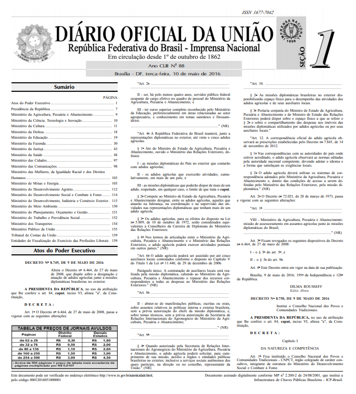
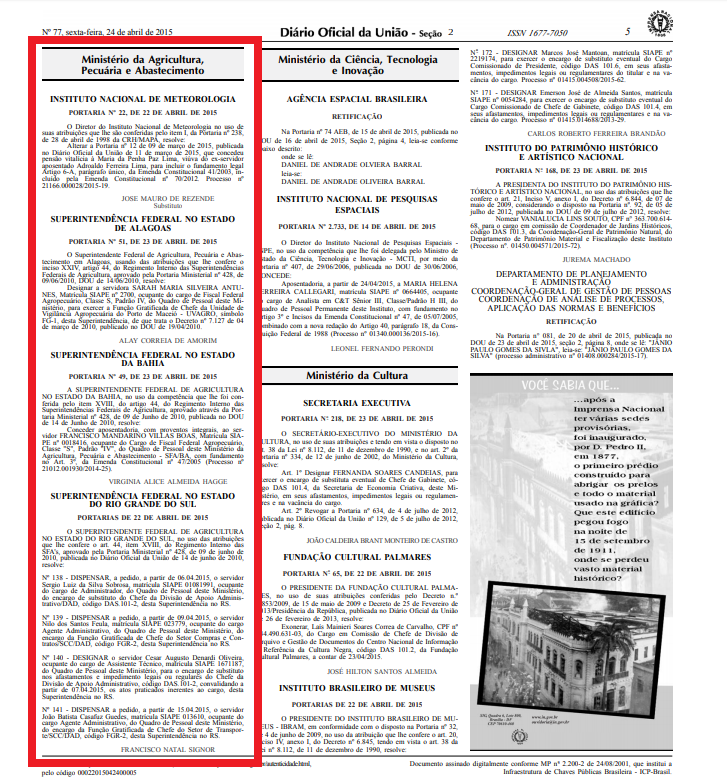

## Caminho

1. O problema
2. A solução proposta
3. Os resultados alcançados

# O Problema

## A fonte

O Diário Oficial da União (DOU) é importante fonte de informações oficiais 
consultadas por diversos atores sociais. A informações publicadas no DOU são 
publicadas em formato de textos, tabelas e imagens, dados não-estrturados.

## A fonte

  

## Os desafios

Até dezemebro 2017 a Imprensa Nacional disponibilizada o DOU somente em PDF. 

A partir de dezembro de 2017 o DOU passa a ser publicado também em HTML (com erros).

Falta de padronização dos textos publicados

## Os desafios

  

# A solução proposta

## Proposta: um pacote R

1. Em linha com os principios do tidyverse
2. Usar `regex` para identificar as informações publicadas


## rdou: Etapas de processamento

O seguinte fluxo de trabalho foi adotado:

1. Download de todos as páginas do DOU (PDF) do dia;
2. Conversão dos PDFs em TXTs pelo Word;
3. Processamento dos arquivos TXT para estruturar a informação; e
4. Validação humana da informação processada.

## rdou: download

```{r, eval = FALSE}
# devtools::install_github("tomasbarcellos/rdou")
library(rdou)
download_dou("02/03/2017", dest_dir = "pdf")
```

A função `download_dou()` faz o download das páginas do DOU, em PDF.
A função é chamada pelo seu efeito colateral (baixar) e retorna 
a `data` (invisível).

## rdou: conversão

```{r, eval = FALSE}
paginas <- converter_pdf(
  data = "02/03/2017", secao = 1,
  dir_pdf = "pdf", dest_dir = "txt"
¡)
```

A função `converter_pdf()` faz a conversão das páginas do DOU de PDF para TXT.
A função é chamada pelo seu efeito colateral e retorna um vetor 
com o nome dos arquivos TXT criados (invisível).

```{r, echo = FALSE}
library(rdou)
paginas <- dir("inst/doc/txt/DOU1/2017/março/02", 
               full.names = TRUE, recursive = TRUE)
```

## rdou: processamento

```{r}
agric <- extrair_normas(paginas, "Agricultura")
faz <- extrair_normas(paginas, "Fazenda")
str(agric, give.attr = FALSE, vec.len = 1)
```

## rdou: processamento

```{r}
# Objetos "norma" possuem alguns atributos
str(attributes(faz), vec.len = 1)
```


## rdou: estruturação das informações

```{r, eval = FALSE}
df_agric <- estruturar_normas(agric)
dplyr::glimpse(df_agric)
```

```{r, echo = FALSE}
df_agric <- readRDS("df_agric.RDS")
dplyr::glimpse(df_agric)
```

## Usando o pipe

```{r, eval = FALSE}
library(magrittr)
download_dou("02/03/2017") %>% 
  converter_pdf(secao = 1) %>% 
  pegar_normas_dou(orgao_alvo = "Agricultura") %>% 
  estruturar_normas()
```

# Resultados

## Resultados

* Mais de 13.705 normas encontradas entre os meses de abril de 2015 e dezembro 
de 2017 nas seções 1 e 2 do DOU para o Ministério da Agricultura, Pecuária e 
Abastecimento.

* Alimentação semi-automatizada do Sistemas de Consulta a Legislação Agropecuária.
